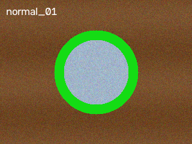
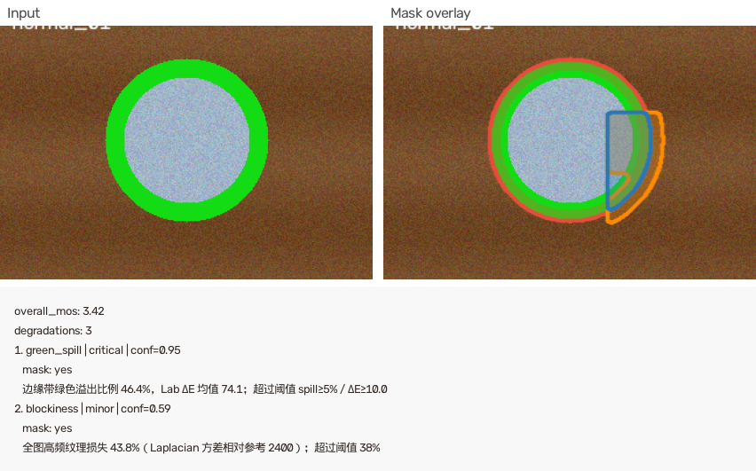

# LocalQualityDegradationDetection

**可解释的局部画质劣化检测（Local Quality Degradation Detection）**

*Explainable local quality degradation detection for offline badcase frames*

[](LICENSE)
[]()
[](specs/USE_CASE_BADCASE.md)

> 输入：离线 badcase 单帧  
> 输出：**不规则 mask** + 数值 Evidence + MOS 影响 + Decision Trace（JSON / HTML）

**完整评测效果与真实业务帧对比** → 见飞书作品集：【在此填写你的飞书文档链接】

---

## Demo（GitHub 可复现）

| 输入帧 | 检测报告（mask 轮廓 + legend） |
|--------|-------------------------------|
|  |  |

- 交互报告：[`examples/demo_report.html`](examples/demo_report.html)
- 更多样例：[`examples/reports/`](examples/reports/)（绿边 / 块效应 / 模糊 / 马赛克 / 色带 / 面部 / 干净帧）
- 可视化风格：[`examples/viz_styles/`](examples/viz_styles/)（contour_only vs contour_fill）

```bash
# 一键生成 examples/ 下所有 demo 资源
python scripts/generate_demo_assets.py

# 单张复现主 demo
python detect.py --image data/sample/frames/edge/edge_01.png \
  --mode fast --legacy-fixed --output examples/demo_report.html
```

---

## 仓库 vs 飞书文档

| 放在 GitHub | 放在飞书文档 |
|-------------|--------------|
| 源代码、规格、测试 | 真实直播帧评测截图 |
| `data/sample/` 内置小样例 | 方案 A–D 跑分与对比表 |
| `examples/` 交互 HTML | Agent / VLM trace 实录 |
| 评测脚本（需自备 manifest） | 个人项目背景与业务语境 |

模板正文可复制 [`docs/FEISHU_EVALUATION.template.md`](docs/FEISHU_EVALUATION.template.md)。  
本地预填版（含本次跑分，**不进 GitHub**）：`docs/FEISHU_EVALUATION.filled.md`

---

## 为什么做（Problem）

局部画质问题**高频、需定位、需归因**，全图 IQA 不够用：

| 痛点 | 现有方案不足 | 本项目 |
|------|-------------|--------|
| badcase 难批量分析 | BRISQUE/NIQE 无定位 | **局部** mask + bbox |
| 糊 / 绿边 / block 混在一起 | 黑箱总分 | **分类型**检测器 + Evidence |
| 质检复核 | 只要分数不够 | HTML + 中文 detail + legend |

**边界**：**离线单帧**，不接 RTMP 实时流；**无参考图 diff**。

---

## 做了什么（Solution）

```
GlobalScan → 9 类检测器 → [Agent: VLM 灰区] → [Judge] → Report（mask + Evidence + MOS）
```

| 阶段 | 检测器 | 方法概要 |
|------|--------|----------|
| 已有 | `edge_bleed` | 绿边 / ΔE 溢色 |
| 已有 | `compression_artifact` | DCT 块效应 + Laplacian 纹理损失 |
| **Phase 1** | `blur_artifact` | 主体区域 Laplacian 纹理损失 |
| **Phase 1** | `mosaic_artifact` | 8×8 块平铺 / 马赛克 |
| **Phase 1** | `banding_artifact` | 背景色带 / 量化台阶 |
| **Phase 1** | `background_artifact` | 背景块效应 + 色彩漂移（独立于全图 compression） |
| **Phase 2** | `hair_texture` | 发丝 ROI FFT 高频能量 |
| **Phase 2** | `face_artifact` | 面部过曝 + Laplacian（可选 InsightFace 扩展） |
| **Phase 2** | `hand_anomaly` | MediaPipe Hands 几何（可选 `[mediapipe]`） |

| 版本 | 形态 | 命令 |
|------|------|------|
| **v0.1** | 固定 Pipeline（全量 9 检测器） | `detect.py --legacy-fixed` |
| **V1**（默认） | Agent 提名路由 + VLM + Judge | `detect.py --mode fast` |

报告字段含 `region_mask_rle`（像素级定位）、`decision_trace`（Agent 决策链）。

---

## 快速开始

### 环境

- Python **3.10+**
- 可选 V1 完整体验：[Ollama](https://ollama.com/) + `qwen2.5-vl:7b`

### 安装与运行

```bash
git clone https://github.com/Chamuel08/LocalQualityDegradationDetection.git
cd LocalQualityDegradationDetection

python -m venv .venv
source .venv/bin/activate
pip install -e ".[dev]"
cp config.example.yaml config.yaml
python scripts/generate_synthetic_samples.py   # 生成 data/sample/
python scripts/generate_demo_assets.py         # 生成 examples/

python detect.py \
  --image data/sample/frames/block/block_01.png \
  --mode fast --legacy-fixed \
  --output report.html
```

### 测试

```bash
pytest tests/ -m "not vlm" -q
```

### 可选：自备 manifest 批量评测

```bash
python benchmark/run_eval.py --manifest /path/to/manifest.json
```

结果写入 `benchmark/results.json`（已 gitignore，不提交）。

---

## V1 Agent 说明

| 场景 | Ollama | 行为 |
|------|--------|------|
| CI / 无 GPU | 不需要 | VLM/Judge 优雅降级，`decision_trace` 记录 skip |
| 完整 V1 | 需要 | 灰区 VLM Confirm + Judge Round 2 |

```bash
ollama pull qwen2.5-vl:7b
python detect.py --image data/sample/frames/edge/edge_01.png --mode fast --output report.html
```

---

## 文档

| 文档 | 内容 |
|------|------|
| [`docs/PORTFOLIO.md`](docs/PORTFOLIO.md) | GitHub 公开范围与面试官体验路径 |
| [`docs/FEISHU_SCREENSHOTS.md`](docs/FEISHU_SCREENSHOTS.md) | 飞书粘贴素材清单（本地 `feishu_export/`） |
| `docs/FEISHU_EVALUATION.filled.md` | 预填飞书正文（本地，gitignore） |
| [`specs/USE_CASE_BADCASE.md`](specs/USE_CASE_BADCASE.md) | Badcase 用例 |
| [`specs/VERSION_ROADMAP.md`](specs/VERSION_ROADMAP.md) | v0.1 / V1 / V2 |

---

## License

[Apache License 2.0](LICENSE)
