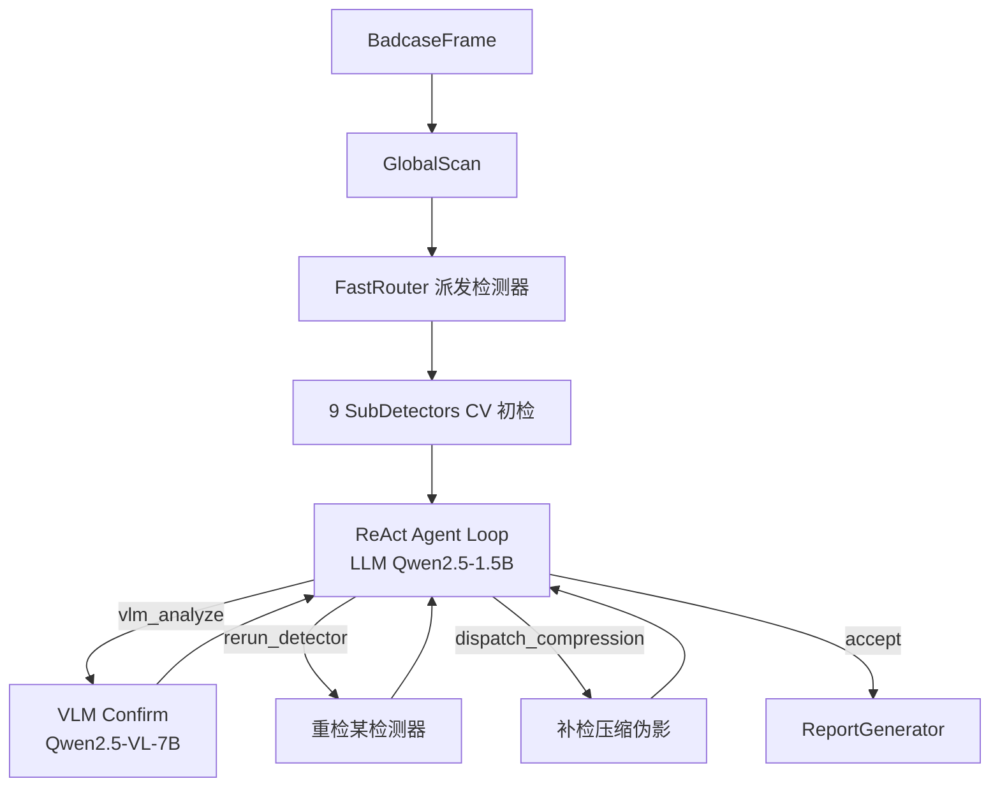

# VERSION_ROADMAP.md — 版本路线图与 Agent 层

> Version Roadmap & Agent Layer v1.0.0

---

## 1. 文档定位

本文件是 **v0.1 / V1 / V2** 能力边界的索引入口，说明：

- 各版本交付什么、不交付什么
- **编排层双模型**（VLM 7B + LLM 1.5B Agent）与子检测器（method_selection §1–7）的分工
- badcase 批量筛图的 **V1 默认路径**（ReAct Agent）

> **V1 架构演进**：V1 编排层最初设计为「灰区硬编码触发 VLM + LLM Judge 审查 + Round 2 补检」，实现时重构为 **ReAct Agent 循环**——VLM 是否调用、是否补检均由 LLM 在每一步自主决策。本文档已按 ReAct 架构更新。

| 文档 | 关系 |
|------|------|
| [`method_selection.md`](method_selection.md) | Stage 2 子检测器算法选型 |
| [`001-v0-fast-mvp/spec.md`](001-v0-fast-mvp/spec.md) | v0.1 GitHub MVP feature |
| [`002-v1-agent-layer/spec.md`](002-v1-agent-layer/spec.md) | V1 Agent 层 feature |
| [`USE_CASE_BADCASE.md`](USE_CASE_BADCASE.md) | Badcase 工作流 |

---

## 2. 版本能力矩阵

| 能力 | v0.1 GitHub MVP | V1 产品 | V2 |
|------|-----------------|---------|-----|
| 输入 | 离线 badcase 单帧 | 离线 badcase 单帧 | 视频 clip（`VideoClipRunner`） |
| 流水线 | **固定** GlobalScan → 9 检测器 → Report | **ReAct Agent** 动态调度 + 反馈循环 | V1 + 时序聚合 |
| 子检测器 | 9 类（6/8 在 demo 上可用，见 README） | 同 v0.1（9 类） | + `temporal_flicker`（帧间层） |
| VLM 视觉确认 | ❌ | ✅ **必需**（Fast Mode，由 LLM Agent 自主触发） | ✅ |
| LLM Agent（自主决策） | ❌ | ✅ **必需**（ReAct 循环，Observe→Think→Act） | ✅ |
| 独立 LLM Judge 阶段 | ❌ | ❌（已被 ReAct Agent 替代；旧 Judge 保留作降级路径） | — |
| Agent 主动发现（vlm_discover） | ❌ | ✅（V1 新增工具，LLM 可自主触发） | ✅ |
| Deep Mode | ❌ | ❌（`--mode deep` 返回 exit 2，未实现） | 推迟（vlm_discover 已满足核心需求） |
| PatchCore 异常检测 | ❌ | ❌ | ❌（违反无参考原则，不建议实现） |
| 外部服务 | 零依赖 | Ollama 或 API（VLM + LLM） | 同 V1 |
| Spec Kit feature | `001-v0-fast-mvp` | `002-v1-agent-layer` | TBD |

**重要**：v0.1 **不做 VLM/LLM** 是交付切片，**不是** V1 产品放弃 Agent 层。

---

## 3. 架构对比

### v0.1 — 固定 Pipeline（无 Agent 层）

```
GlobalScan → 9 SubDetectors → ReportGenerator → JSON/HTML
```

- 目的：clone 即跑、CI 友好、可复现 demo
- 实现：`fast_pipeline.py`（`--legacy-fixed`）
- 9 个检测器：edge_bleed / compression / blur / mosaic / banding / background / hair_texture / face_artifact / hand_anomaly（其中 `banding` 检出率偏低、`hand_anomaly` 为实验性 MVP，见 README 已知限制）

### V1 Fast Mode — ReAct Agent 编排（badcase 默认）



- **批量筛图**默认路径：`detect.py --mode fast`（ReAct Agent，非纯 fixed pipeline）
- Router 仅做检测器派发（灰区也 dispatch 给 CV），**不再硬编码 VLM 路由**
- **LLM Agent 观察 CV 全量结果后自主决策**：是否调用 VLM、是否补检，直到 `accept`
- 最大步数 = `agent.max_rounds × 3`（默认 6 步）；单帧 VLM 调用受 `vlm.max_calls_per_frame` 限制
- 旧 `run_judge` / Round 2 执行器保留作降级路径，主链路无独立 Judge 阶段

### V1 Deep Mode — 单条深度归因（未实现）

```
VLM 粗分（全帧）→ 按清单调度子检测器量化 → Report
```

- CLI：`--mode deep` 当前返回 exit 2（stub）；计划在 V2 实现

---

## 4. 编排层职责划分

| 组件 | 模型 | 输入 | 决策范围 | 非职责 |
|------|------|------|----------|--------|
| **子检测器** | 小模型 / 规则 | ROI | 数值 Evidence + confidence | 全帧整合、补检调度 |
| **VLM Confirm** | Qwen2.5-VL-7B (Ollama/API) | ROI crop + 单子检测器 preliminary | 该 ROI 是否 degraded（L3 语义） | 全帧 MOS 聚合、自主决定是否被调用 |
| **LLM Agent（ReAct）** | Qwen2.5-1.5B (Ollama) | 全帧 CV degradations + MOS + 历史步骤 | 每步选择工具：`vlm_analyze` / `rerun_detector` / `dispatch_compression` / `accept` | 替代 ReportGenerator；无限制重跑 |
| **ReportGenerator** | 无 | 合并后 degradations | MOS 公式、Schema 输出 | 自主决定是否补检 |

职责边界详见 [`002-v1-agent-layer/spec.md`](002-v1-agent-layer/spec.md) 与 [`002-v1-agent-layer/plan.md`](002-v1-agent-layer/plan.md)。

### LLM Agent 工具白名单（ReAct 每步可选）

| action | 说明 |
|--------|------|
| `vlm_analyze` | 对指定/未确认检测项调用 VLM 视觉确认 |
| `rerun_detector` | 调整阈值重跑**单个**检测器（delta ∈ [-0.15, -0.05]） |
| `dispatch_compression` | MOS 低且无 compression 检出时追加压缩伪影检测 |
| `vlm_discover` | **V2 新增**：对全帧主动扫描发现 CV 规则检不到的语义异常（AI 生成伪影等），每帧最多调用 1 次，结果写入 `agent_meta.vlm_discover_findings` |
| `accept` | 接受当前结果，终止循环 |

完整定义见 `002-v1-agent-layer/contracts/llm-judge.schema.json`（旧 Judge 输出，向后兼容）与 `src/lqdd/agent/prompts.py`（ReAct `AGENT_SYSTEM_PROMPT`）。

---

## 5. 开源模型清单

| 角色 | 推荐模型 | 许可证 | 运行时 |
|------|----------|--------|--------|
| VLM 视觉兜底 | Qwen2.5-VL-7B | Apache-2.0 | Ollama / vLLM / 云端 API |
| LLM Judge | Qwen2.5-1.5B | Apache-2.0 | Ollama（CPU 可运行） |
| 子检测器 | InsightFace、MediaPipe、OpenCV 等 | 见 method_selection | 本地 |

配置见仓库根目录 `config.example.yaml`（`vlm`、`llm_judge` 段）。

---

## 6. 降级策略

| 场景 | 行为 |
|------|------|
| VLM 不可用 | Agent 调用 `vlm_analyze` 时该工具失败，trace 记 `vlm_failed: service_unavailable`；CV 结果照常进入聚合 |
| LLM 不可用 | Agent 降级到 `RuleBasedJudgeClient`（规则决策）；再不可用则直接 `accept` |
| VLM 调用达上限 | `vlm_analyze` 跳过，trace 记 `vlm_skipped: quota_exceeded` |
| Deep Mode | `--mode deep` 当前未实现，返回 exit 2（V2 计划） |

v0.1 无上述组件，主链路不依赖外部服务。

---

## 7. 实现顺序建议

1. **001 v0.1** — fixed pipeline + 子检测器 + CLI（原始切片 2 检测器，后续扩展至 9 类）
2. **002 V1 Agent** — VLMReasoner + LLMJudge + AgentOrchestrator + 反馈循环
3. **V1 检测器补全** — face / hair / hand / background（可与 002 并行部分）
4. **V2** — vlm_discover（✅）+ VideoClipRunner（✅）+ TemporalFlicker（✅）

## 8. V2 实现决策记录

| 功能 | 决策 | 原因 |
|------|------|------|
| `vlm_discover` 工具 | ✅ **已实现** | 改动面小（新增一个工具），直接补充 CV 盲区 |
| `VideoClipRunner` 包装器 | ✅ **已实现** | 外层包装，不改单帧接口，零侵入 |
| `TemporalFlicker` 检测器 | ✅ **已实现** | 帧间聚合层调用，不进 ALL_DETECTOR_NAMES |
| Deep Mode（VLM 先行） | ⏸ **推迟** | `vlm_discover` 已能满足核心需求，Deep Mode 重构代价高且职责冲突 |
| PatchCore / 预训练异常检测 | ❌ **不实现** | 违反系统「无参考」核心原则；需要维护正常样本 memory bank |

---

## 8. Agent vs Workflow（一句话）

**Workflow**：路径在编码时确定，无反馈循环。
**Agent（ReAct）**：LLM 在每一步读 CV 结果 + 历史 observation，**自主决定**是否调用 VLM、是否补检，有状态（`AgentContext` / `agent_steps`）与终止条件（`accept` 或达 `max_rounds × 3` 步）。VLM 触发由 LLM 推理决定，而非硬编码灰区阈值。