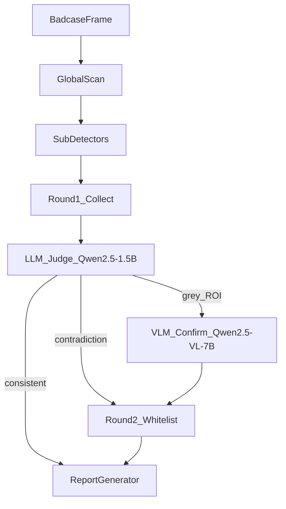

# VERSION_ROADMAP.md — 版本路线图与 Agent 层

> Version Roadmap & Agent Layer v1.0.0

---

## 1. 文档定位

本文件是 **v0.1 / V1 / V2** 能力边界的索引入口，说明：

- 各版本交付什么、不交付什么
- **编排层双模型**（VLM 7B + LLM 1.5B Judge）与子检测器（method_selection §1–7）的分工
- badcase 批量筛图的 **V1 默认路径**

| 文档 | 关系 |
|------|------|
| [`method_selection.md`](method_selection.md) | Stage 2 子检测器算法选型 |
| [`001-v0-fast-mvp/spec.md`](001-v0-fast-mvp/spec.md) | v0.1 GitHub MVP feature |
| [`002-v1-agent-layer/spec.md`](002-v1-agent-layer/spec.md) | V1 Agent 层 feature |
| [`USE_CASE_BADCASE.md`](USE_CASE_BADCASE.md) | Badcase 工作流 |

---

## 2. 版本能力矩阵

| 能力 | v0.1 GitHub MVP | V1 产品 | V2 |
|------|-----------------|---------|-----|
| 输入 | 离线 badcase 单帧 | 离线 badcase 单帧 | 视频 clip |
| 流水线 | **固定** GlobalScan → 2 检测器 → Report | **Agent** 动态调度 + 反馈循环 | V1 + 时序 |
| 子检测器 | edge_bleed, compression_artifact | 6 类 spatial + compression | + temporal_flicker |
| VLM 灰区兜底 | ❌ | ✅ **必需**（Fast Mode） | ✅ |
| LLM Judge（自我决策） | ❌ | ✅ **必需**（Round 1/2） | ✅ |
| Deep Mode | ❌ | ✅ 可选（单条深度归因） | ✅ |
| 外部服务 | 零依赖 | Ollama 或 API（VLM + LLM） | 同 V1 |
| Spec Kit feature | `001-v0-fast-mvp` | `002-v1-agent-layer` | TBD |

**重要**：v0.1 **不做 VLM/LLM** 是交付切片，**不是** V1 产品放弃 Agent 层。

---

## 3. 架构对比

### v0.1 — 固定 Pipeline（无 Agent 层）

```
GlobalScan → EdgeBleed + CompressionArtifact → ReportGenerator → JSON/HTML
```

- 目的：clone 即跑、CI 友好、可复现 demo
- 实现：`fast_pipeline.py`（`--legacy-fixed`）

### V1 Fast Mode — Agent 编排（badcase 默认）



- **批量筛图**默认路径：`detect.py --mode fast`（含 Agent，非纯 fixed pipeline）
- 子检测器 confidence ∈ **[0.4, 0.7]** → VLM Confirm（ROI 级 badcase 兜底）
- Round 1 结束后 → **LLM Judge** 审查全帧一致性 → 可选 Round 2（白名单动作，最多 1 轮）

### V1 Deep Mode — 单条深度归因（可选）

```
VLM 粗分（全帧）→ 按清单调度子检测器量化 → Report
```

- CLI：`--mode deep`；失败自动 fallback Fast（见 USE_CASE §4）

---

## 4. 编排层职责划分

| 组件 | 模型 | 输入 | 决策范围 | 非职责 |
|------|------|------|----------|--------|
| **子检测器** | 小模型 / 规则 | ROI | 数值 Evidence + confidence | 全帧整合、补检调度 |
| **VLM Confirm** | Qwen2.5-VL-7B (Ollama/API) | ROI crop + 单子检测器 preliminary | 该 ROI 是否 degraded（L3 语义） | 全帧 MOS 聚合、open-ended 调度 |
| **LLM Judge** | Qwen2.5-1.5B (Ollama) | 全帧 degradations + MOS + trace 摘要 | consistent / uncertain / inconsistent；Round 2 **白名单 actions** | 替代 ReportGenerator；无限制重跑 |
| **ReportGenerator** | 无 | 合并后 degradations | MOS 公式、Schema 输出 | 自主决定是否补检 |

职责边界详见 [`002-v1-agent-layer/spec.md`](002-v1-agent-layer/spec.md) 与 [`002-v1-agent-layer/plan.md`](002-v1-agent-layer/plan.md)。

### LLM Judge 白名单 actions（Round 2）

| action | 说明 |
|--------|------|
| `vlm_analyze` | 仅当灰区 VLM 未触发时 |
| `rerun_detector` | 降低阈值重跑**单个**检测器 |
| `dispatch_compression` | MOS 低且无检出时追加 compression |
| `accept` | 确认结果，不补检 |

完整定义见 `002-v1-agent-layer/contracts/llm-judge.schema.json`。

---

## 5. 开源模型清单

| 角色 | 推荐模型 | 许可证 | 运行时 |
|------|----------|--------|--------|
| VLM 视觉兜底 | Qwen2.5-VL-7B | Apache-2.0 | Ollama / vLLM / 云端 API |
| LLM Judge | Qwen2.5-1.5B | Apache-2.0 | Ollama（CPU 可运行） |
| 子检测器 | InsightFace、MediaPipe、OpenCV 等 | 见 method_selection | 本地 |

配置见仓库根目录 `config.example.yaml`（`vlm`、`llm_judge` 段）。

---

## 6. 降级策略

| 场景 | 行为 |
|------|------|
| VLM 不可用（Fast 灰区） | 跳过 VLM Confirm；硬阈值判定；trace 记 `vlm_skipped` |
| LLM Judge 不可用 | 跳过 Judge 与 Round 2；直接 Report；trace 记 `judge_skipped` |
| Deep Mode VLM 失败 | 自动 fallback Fast Mode；报告 `mode_degraded: true` |

v0.1 无上述组件，主链路不依赖外部服务。

---

## 7. 实现顺序建议

1. **001 v0.1** — fixed pipeline + 2 检测器 + CLI
2. **002 V1 Agent** — VLMReasoner + LLMJudge + AgentOrchestrator + 反馈循环
3. **V1 检测器补全** — face / hair / hand / background（可与 002 并行部分）
4. **V2** — 视频 + TemporalFlicker

---

## 8. Agent vs Workflow（一句话）

**Workflow**：路径在编码时确定，无 Round 2。  
**Agent**：LLM Judge 读 Round 1 全量结果，**自主决定**是否 VLM 确认、是否补检，有状态（AgentContext）与终止条件（最多 2 轮）。
